# Phishing Email Detection & Awareness Dashboard

<div align="center">


</div>

> A defensive cybersecurity dashboard for analyzing email sender, subject, message content, URLs, and attachment names. It uses explainable rules to calculate a phishing risk score, presents recommended actions, and records analysis history.

---

## 👨‍💻 Author

**Adarsh Srivastav**

Computer Science and Engineering (CSE) Student
Cybersecurity | Python | Streamlit | Data Analysis

---

## 📌 Project Overview

The **Phishing Email Detection & Awareness Dashboard** is an educational tool that demonstrates a defensive email-triage workflow. A user enters an email's sender, display name, subject, body, URLs, and attachment name, or loads one of the fictional built-in examples. The dashboard evaluates those inputs with transparent rule-based checks and explains the signals that contributed to its assessment.

The results include an overall risk score and classification, separate sender/content/URL/attachment scores, findings, safe-response recommendations, awareness guidance, and locally stored analysis history.

> **Project note:** This is a learning and portfolio project—not a production email-security gateway. A risk score is a heuristic assessment, not proof that a message is malicious or safe. The app does not fetch URLs, inspect attachment contents, or contact external threat-intelligence services.

---

## 🎯 Objectives

- Demonstrate a repeatable phishing email review workflow.
- Inspect sender structure and possible display-name mismatches.
- Identify urgency, fear, financial-pressure, credential-request, and personal-information language.
- Flag URL patterns such as raw IP addresses, shorteners, unusual schemes, and suspicious hostnames.
- Identify attachment names with potentially risky file extensions.
- Produce an explainable risk score, classification, and recommended next steps.
- Provide practical phishing-awareness guidance.
- Keep a history of analyses and export a text report or CSV history.
- Use fictional and synthetic examples for safe demonstrations.

---

## ✨ Key Features

- Streamlit dashboard with fictional safe and phishing example profiles
- Manual email analysis form and `.txt` / `.eml` file upload
- Sender, content, URL, and attachment indicator analysis
- Transparent findings and defensive recommendations
- Weighted overall risk score and four risk classifications
- Threat-indicator chart and detailed findings tables
- Phishing awareness guidance
- SQLite-backed analysis history
- Downloadable analysis report (`.txt`) and history (`.csv`)
- Generated synthetic dataset with 600 email examples
- Unit tests for representative safe and suspicious messages
- Optional educational machine-learning helper in `src/ml_model.py` (not used for the dashboard's primary verdict)

---

## 🏗️ System Architecture


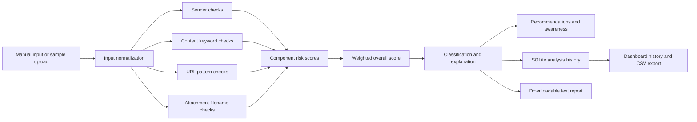

---

## 🔄 Working Principle

```text
Enter email details or load a fictional example
                    ↓
Normalize sender, subject, body, URLs, and attachment name
                    ↓
Analyze sender + content + URLs + attachment extension
                    ↓
Calculate component risk scores
                    ↓
Combine scores and classify the message
                    ↓
Show findings, recommendations, and awareness guidance
                    ↓
Save the result in local SQLite history
                    ↓
Export a text report or CSV history
```

### Analysis Areas

| Area | Example checks |
|---|---|
| Sender | Invalid or unusually long domain, multiple subdomain levels, suspicious domain keywords, display-name mismatch |
| Content | Urgency, fear, financial pressure, credential requests, personal-information requests, generic greeting |
| URL | Raw IP address, known shortener pattern, unusual scheme, suspicious hostname terms, deeply nested hostname |
| Attachment | Filename extension associated with executable, script, shortcut, or archive content |

These are simple indicators for demonstration and triage. They do not replace message authentication checks, reputation services, malware analysis, or analyst review.

---

## 📊 Risk Scoring and Classification

Each analysis area produces an indicator score from 0 to 100. The dashboard combines those component scores using the current weights:

```text
Overall score = round(
    Sender score     × 0.40
  + Content score    × 0.50
  + URL score        × 0.20
  + Attachment score × 0.15
)

Final score is capped at 100.
```

The total of the weights is greater than 1; the final cap prevents the displayed score from exceeding 100. The thresholds are:

| Score | Classification |
|---:|---|
| 0–24 | `SAFE` |
| 25–49 | `LOW RISK` |
| 50–74 | `SUSPICIOUS` |
| 75–100 | `HIGH RISK / LIKELY PHISHING` |

The `SAFE` label means the current rules found few obvious indicators. It is not a guarantee that an email is legitimate.

---

## 🧰 Software and Tools

- **Language:** Python 3.11+
- **Dashboard:** Streamlit
- **Data handling:** pandas, NumPy
- **Optional ML helper:** scikit-learn
- **Persistence:** SQLite
- **Testing:** pytest
- **Version control:** Git and GitHub
- **Deployment option:** Streamlit Community Cloud

Install dependencies from `requirements.txt`. The dashboard's primary classification uses the explainable rule-based engine; the optional ML helper is separate.

---

## 🖥️ Dashboard Sections

| Section | What it shows |
|---|---|
| Email analysis form | Sender, display name, subject, body, URLs, attachment name, and sample upload |
| Executive overview | Overall score, classification, explanation, recommendations, and feature snapshot |
| Threat indicators | Component-score chart and detailed sender/content/URL/attachment findings |
| Education | Defensive phishing-awareness tips |
| Export & history | Downloadable report, recent analysis records, and CSV export |

---

## 📸 Project Screenshots

### Dashboard Overview

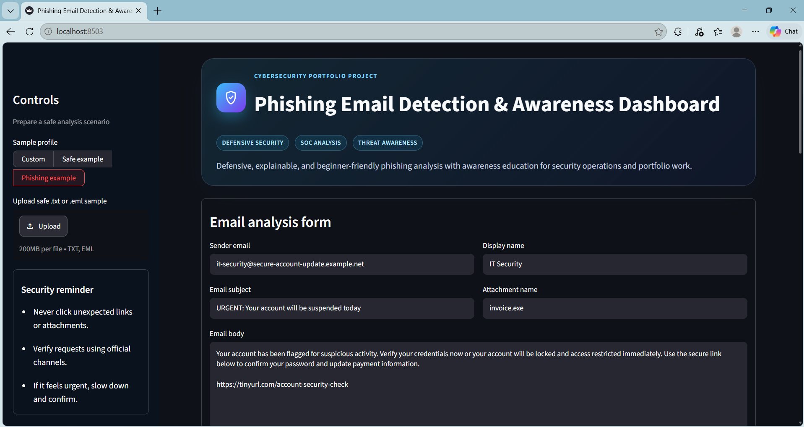

<details>
<summary>View all 13 dashboard screenshots</summary>

| Screenshot | Preview |
|---|---|
| Email analysis input form | 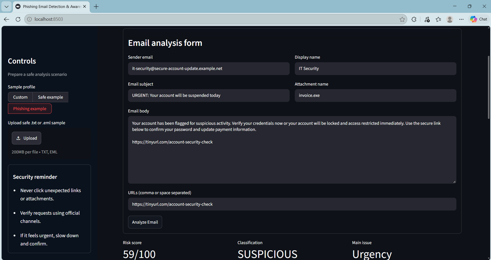 |
| Suspicious phishing result | 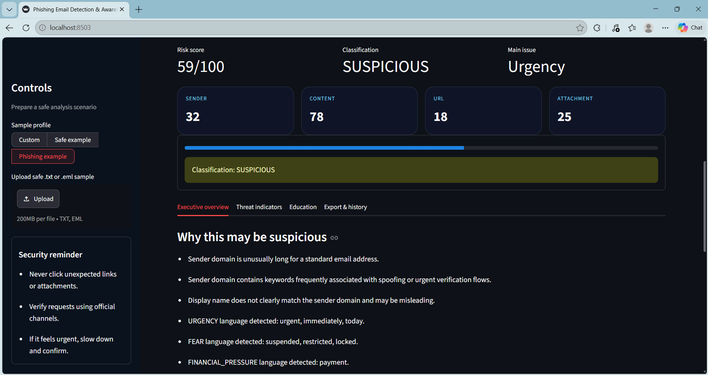 |
| Risk score breakdown | 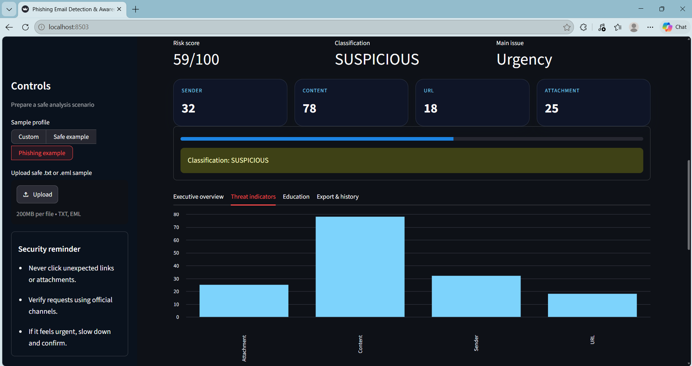 |
| Sender analysis | 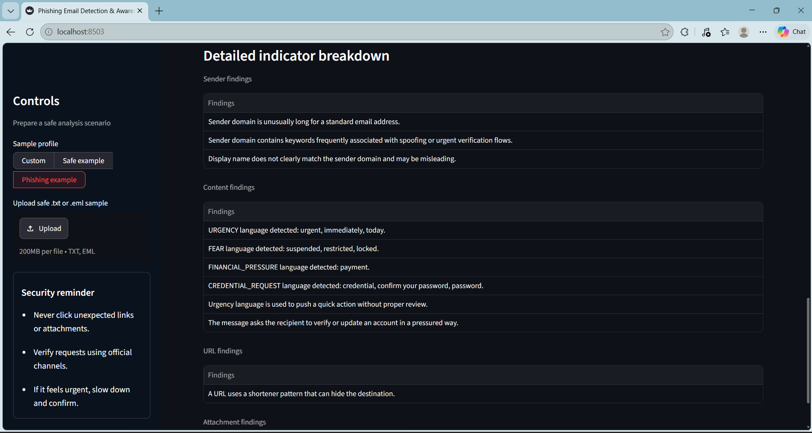 |
| Content analysis |  |
| URL analysis |  |
| Attachment analysis | 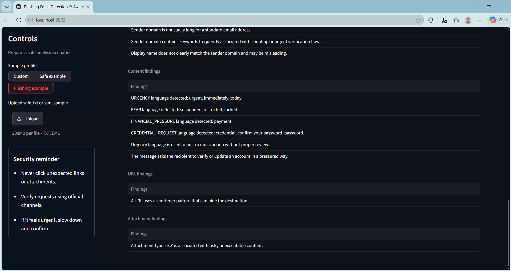 |
| Findings and recommendations | 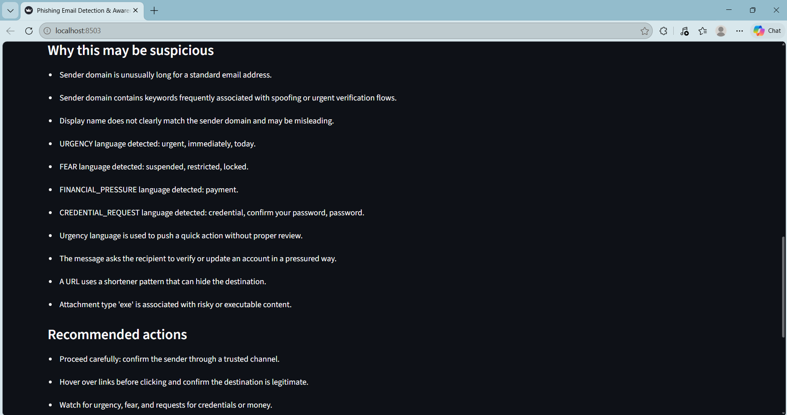 |
| Security awareness | 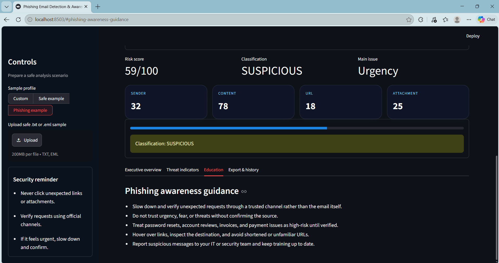 |
| Analysis history | 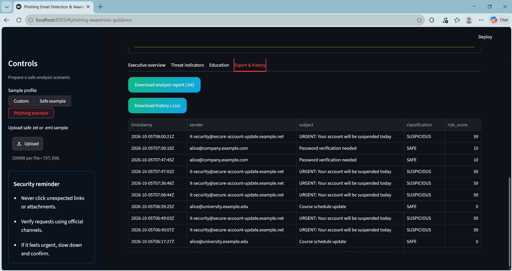 |
| Downloaded analysis report | 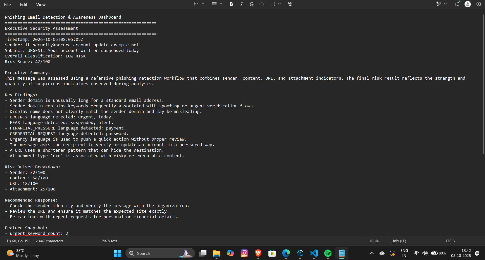 |
| Safe email result | 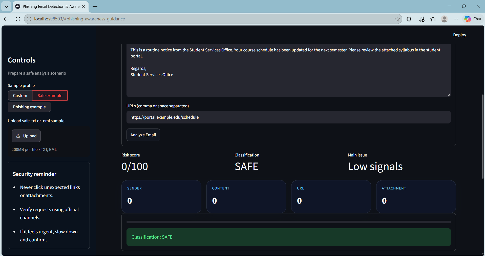 |

</details>

---

## 📁 Project Structure

```text
Phishing-Email-Detection-Awareness-Dashboard/
├── .streamlit/
│   └── config.toml                 # Streamlit server configuration
├── Screenshots/                    # Captured dashboard and report evidence
│   ├── 01_dashboard_overview.png
│   ├── 02_email_analysis_input_form.png
│   ├── 03_suspicious_phishing_result.png
│   ├── 04_risk_score_breakdown.png
│   ├── 05_sender_analysis.png
│   ├── 06_content_analysis.png
│   ├── 07_url_analysis.png
│   ├── 08_attachment_analysis.png
│   ├── 09_findings_and_recommendations.png
│   ├── 10_security_awareness.png
│   ├── 11_analysis_history.png
│   ├── 12_downloaded_analysis_report.png
│   └── 13_safe_email_result.png
├── data/
│   ├── analysis_history.db          # SQLite analysis history
│   └── phishing_email_dataset.csv  # Synthetic training/demo dataset
├── docs/
│   ├── assets/
│   │   ├── architecture-diagram.svg
│   │   └── github-banner.svg
│   ├── LINKEDIN_POST.md
│   └── PROJECT_REPORT.md
├── src/
│   ├── __init__.py
│   ├── config.py                    # Paths and indicator keyword lists
│   ├── database.py                  # SQLite history persistence
│   ├── dataset_generator.py         # Synthetic dataset generation
│   ├── ml_model.py                  # Optional educational ML helper
│   └── phishing_engine.py           # Rule-based analysis and scoring
├── tests/
│   └── test_phishing_engine.py      # Detection-engine tests
├── .gitignore
├── app.py                           # Streamlit dashboard entry point
├── README.md
└── requirements.txt
```

The virtual environment and Python cache directories are local development artifacts and are not part of the documented repository structure.

---

## ▶️ How to Run the Project

### Windows

Open PowerShell in the project folder and run:

```powershell
py -3.11 -m venv .venv
.\.venv\Scripts\Activate.ps1
python -m pip install -r requirements.txt
python -m src.dataset_generator
streamlit run app.py
```

If PowerShell blocks virtual-environment activation, use the environment's executable directly:

```powershell
.\.venv\Scripts\python.exe -m pip install -r requirements.txt
.\.venv\Scripts\python.exe -m src.dataset_generator
.\.venv\Scripts\streamlit.exe run app.py
```

Streamlit prints a local URL, typically `http://localhost:8501`. Open that address in a browser.

### macOS / Linux

```bash
python3 -m venv .venv
source .venv/bin/activate
python -m pip install -r requirements.txt
python -m src.dataset_generator
streamlit run app.py
```

### Use the Dashboard

1. Choose **Safe example**, **Phishing example**, or **Custom** in the Controls panel.
2. Review or edit the sender, display name, subject, body, URLs, and attachment name.
3. Optionally upload a fictional `.txt` or `.eml` sample.
4. Select **Analyze Email**.
5. Review the overview, threat indicators, and recommended actions.
6. Open **Education** or **Export & history** for awareness tips and output options.

Use fictional or synthetic examples only. Do not upload confidential or personally identifiable email.

---

## 🧪 Testing

Run the detection-engine tests from the repository root:

```bash
pytest
```

The current test set covers a suspicious phishing example and a low-risk legitimate example.

---

## 🗃️ Synthetic Dataset

`data/phishing_email_dataset.csv` contains 600 generated examples, with synthetic phishing and legitimate messages, fictional domains, sample URLs, attachment names, and labels. It is intended for demonstration and educational experimentation, not as a representative real-world email corpus.

Regenerate it with:

```bash
python -m src.dataset_generator
```

---

## ☁️ Deploy to Streamlit Community Cloud

The repository uses a root-level `app.py` and `requirements.txt`, so it follows the standard Streamlit app layout.

1. Push the repository to GitHub.
2. Open [Streamlit Community Cloud](https://streamlit.io/cloud) and create a new app.
3. Select this repository, the desired branch, and `app.py` as the entry point.
4. Deploy and use the URL provided by Streamlit.

The SQLite analysis history is local to the app runtime. Hosted environments may not retain local database changes across restarts or redeployments; use a managed database for persistent production history.

---

## 🔐 Safe Use and Limitations

- This project is for defensive learning, demonstration, and portfolio use.
- It does not send phishing messages, collect credentials, or target real users or systems.
- Only use fictional samples and safe example URLs.
- URL analysis is pattern-based; it does not resolve or visit URLs.
- Attachment checks use the supplied filename only; files are not opened or scanned.
- Rule-based results can produce false positives and false negatives.
- A low score does not establish that a message is safe.
- The application is not a replacement for an email security product or an incident-response investigation.
- Do not upload real confidential email or sensitive personal information.

---

## 🚀 Future Scope

- Add configurable thresholds and per-category score explanations.
- Improve `.eml` parsing while keeping uploaded content local and safe.
- Add analyst-controlled allow/deny lists for demonstration.
- Add visual history trends and filtering.
- Add more tests for malformed input, URL edge cases, and file types.
- Evaluate optional ML predictions separately against a documented dataset split.
- Add a managed database and authentication only if extending beyond a local educational demo.

---

## 🎓 Skills Demonstrated

### Cybersecurity

- Phishing and social-engineering indicator identification
- Defensive triage concepts and safe user recommendations
- Explainable heuristic risk scoring
- Awareness education and ethical project boundaries

### Python and Data

- Modular Python application design
- Text preprocessing and feature extraction
- CSV dataset generation and analysis
- SQLite persistence
- Optional scikit-learn text-classification helper

### Application Development

- Streamlit forms, tabs, metrics, charts, and data tables
- File upload and downloadable report workflows
- Unit testing with pytest
- Git, GitHub, and project documentation

---

## 💼 Industry Relevance

The project models an introductory email-triage flow that is relevant to SOC, email-security, and security-awareness work:

```text
Email reported or submitted
          ↓
Inspect sender, wording, URLs, and attachment indicators
          ↓
Assess and explain risk signals
          ↓
Recommend safe verification and reporting actions
          ↓
Record the analysis for review
```

It is an educational simulation of these concepts, not an operational SOC or mail-filtering system.

---

## 📚 Additional Documentation

- [Project report](docs/PROJECT_REPORT.md) — workflow, industry relevance, technical choices, and interview notes
- [LinkedIn project summary](docs/LINKEDIN_POST.md)
- [System architecture diagram](docs/assets/architecture-diagram.svg)

---

## 📄 License and Project Status


This repository is intended for learning and educational use.

**Status:** Functional educational Streamlit dashboard with explainable rule-based analysis, awareness content, SQLite history, and report export. It is not production-grade security software.

---

## ⭐ Conclusion

The **Phishing Email Detection & Awareness Dashboard** demonstrates how common email-risk signals can be organized into an explainable analysis workflow. It combines sender, content, URL, and attachment indicators with defensive recommendations, awareness guidance, and a simple dashboard for reviewing results.

```text
INPUT
  ↓
INDICATOR ANALYSIS
  ↓
EXPLAINABLE RISK SCORE
  ↓
CLASSIFICATION + RECOMMENDATIONS
  ↓
AWARENESS + HISTORY + EXPORT
```

---

**Project focus: Defensive cybersecurity | Explainable analysis | Safe, synthetic examples**
