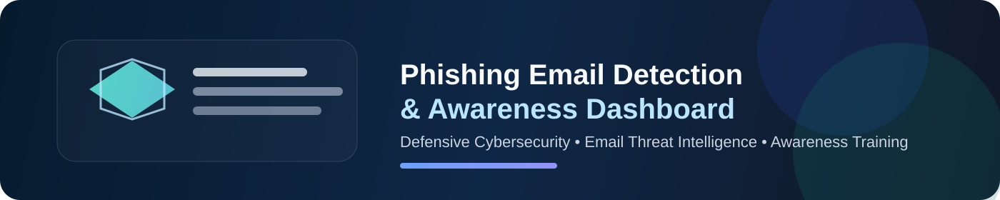
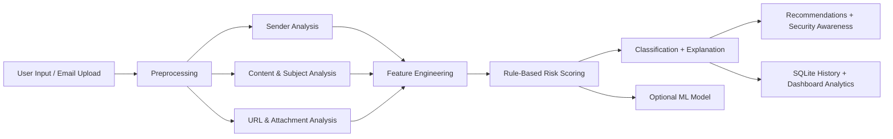

# Phishing Email Detection & Awareness Dashboard

<div align="center">




</div>

A defensive cybersecurity project that demonstrates phishing email analysis, explainable scoring, URL checks, and user awareness training in a beginner-friendly, portfolio-ready format.

## Why this project matters

Phishing remains one of the most common entry points for cyber attacks. This project shows how security teams combine rule-based analysis, feature engineering, and awareness education to identify risky emails before users click harmful links or open malicious attachments.

## Project objective

This project allows users to:

- paste email content
- enter sender and subject details
- upload safe `.txt`/`.eml` samples
- analyze suspicious URLs and attachments
- detect urgency, fear, and manipulation language
- assign a phishing risk score
- classify the message as safe or suspicious
- receive explainable recommendations
- review historical analysis in a dashboard

The project is intentionally defensive, ethical, and educational. It does not send phishing emails, collect credentials, or target real users or systems.

## Architecture overview




## Core features

- rule-based phishing detection engine
- URL, sender, content, and attachment analysis
- explainable risk reasoning
- synthetic phishing and legitimate email dataset
- SQLite-based analysis history
- Streamlit dashboard with analytics and awareness sections
- downloadable executive-style report export
- optional educational ML helper

## Screenshot preview

Use these placeholders for GitHub/LinkedIn polish:


## Project structure

```text
.
├── app.py                     # Streamlit dashboard entry point
├── requirements.txt           # Python dependencies
├── README.md                  # Project guide
├── docs/
│   └── PROJECT_REPORT.md      # Industry-facing report and interview notes
├── data/
│   ├── phishing_email_dataset.csv
│   └── analysis_history.db
├── src/
│   ├── __init__.py
│   ├── config.py              # Shared settings and keyword lists
│   ├── database.py            # SQLite history persistence
│   ├── dataset_generator.py   # Creates 600 synthetic email examples
│   ├── phishing_engine.py     # Core phishing detection engine
│   └── ml_model.py            # Optional ML model training helper
├── tests/
│   └── test_phishing_engine.py
├── .gitignore
└── .venv/                     # local virtual environment (not committed)
```

## Quick start

```bash
cd "d:\Diploma Course\subjects\Cyber Security\Phishing Email Detection & Awareness Dashboard"
python -m venv .venv
.\.venv\Scripts\activate
pip install -r requirements.txt
python -m src.dataset_generator
streamlit run app.py
```

## Synthetic dataset

The project includes a generated dataset with 600+ synthetic examples in `data/phishing_email_dataset.csv`.

It includes:

- legitimate university, HR, meeting, newsletter, and shopping emails
- phishing examples such as fake account verification, invoice pressure, password expiration, and urgent executive requests
- fictional domains such as `example.com`, `example.org`, `example.net`, and `invalid.test`

## Safe usage guidelines

- use fictional URLs only
- do not send phishing emails
- do not collect credentials
- do not target real users or systems
- treat this as a learning and defensive tool instead of a production security system

## How detection works

This project combines several layers of analysis:

- sender analysis checks domain quality, suspicious patterns, and display-name mismatches
- content analysis identifies urgency, fear, credential requests, and financial pressure
- URL analysis checks for shortened links, suspicious hostnames, and IP-based destinations
- attachment analysis looks for executable and archive file risks
- the final score explains why the email looks risky and recommends safe next steps

## Risk scoring model

The final score is mapped to these categories:

- SAFE
- LOW RISK
- SUSPICIOUS
- HIGH RISK / LIKELY PHISHING

This is educational and explainable, which is important in cybersecurity because a model should justify its decision instead of acting like a black box.

## Dashboard features

- email input and safe sample upload
- sender, subject, body, URL, and attachment analysis
- explainable findings and recommendations
- risk breakdown by category
- download-ready report export
- recent analysis history
- awareness education section

## Optional ML model

The project includes a lightweight helper in `src/ml_model.py` that demonstrates a text-based ML pipeline trained on synthetic data.

This is optional and educational; the primary engine is rule-based and highly explainable, which is a strong choice for a student or junior security portfolio project.

## Project report and interview materials

See `docs/PROJECT_REPORT.md` for:

- phishing fundamentals
- industry relevance
- workflow explanation
- responsibilities for SOC and email security roles
- resume-ready narrative and interview prep guidance

## GitHub strategy

To make this project portfolio-ready:

1. keep the repo clean and modular
2. add a strong README and architecture diagram
3. include screenshots and quick-start instructions
4. document the ethical, defensive design decisions
5. explain how the project maps to real SOC and email security workflows

## Testing

```bash
pytest
```

## License

This project is intended for learning and educational use only.

## Summary

This project demonstrates how cybersecurity teams convert suspicious email signals into explainable decisions. It combines practical phishing indicators, dashboard analytics, awareness training, and a safe example dataset into one complete portfolio-ready project.
